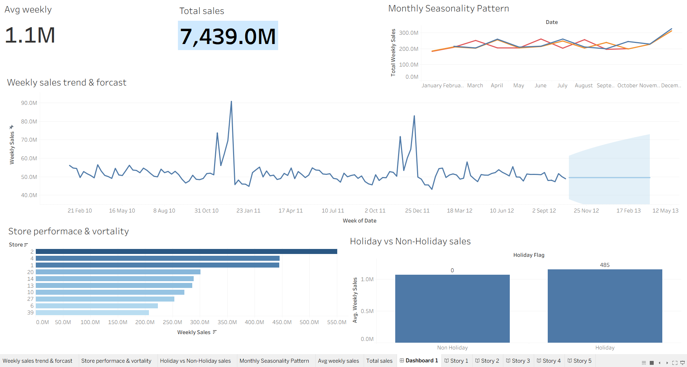

Walmart Sales Analysis using SQL & Tableau

Project Overview
This project analyzes Walmart’s weekly sales data across 45 stores to identify sales trends, store performance, seasonality, and holiday impact. The analysis was conducted using SQL for data preparation and Tableau for visualization and forecasting.

Tools & Technologies
- SQL (MySQL)
- Tableau Public
- CSV data source

Key Analysis Performed
- Weekly sales trend analysis with forecasting
- Store-level performance comparison
- Holiday vs non-holiday sales impact
- Monthly seasonality analysis

Dashboard
Tableau Public Dashboard:  
https://public.tableau.com/your-dashboard-link

Business Insights
- Holiday periods drive significantly higher average weekly sales.
- Sales exhibit strong year-end seasonality across all years.
- A small subset of stores contributes the majority of total revenue.
- Demand forecasting indicates stable baseline sales with seasonal variation.

Repository Structure
- `sql/` – Database schema, data import, and analysis queries
- `tableau/` – Dashboard link and screenshots
- `insights/` – Written business insights

Conclusion
This project demonstrates an end-to-end analytics workflow, from raw data preparation in SQL to insight-driven visualization and forecasting in Tableau.
